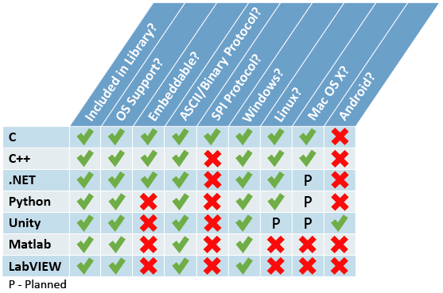

# VectorNav Programming Library

The VectorNav Programming Library contains a collection of resources for developers using VectorNav's orientation and inertial sensor products. The library is divided into different sections and you should consult the section you will primarily be using for more specific resources.

- C
- C++
- .NET
- Python
- MATLAB
- LabVIEW
- Unity

## Overview
The VectorNav Programming Library consolidates and revamps the previous collection of individual libraries providing a single download source for all development needs when working with VectorNav's sensors. The revamped source code allows a larger assortment of development environments, provides the ability of finer grained performance tuning, and makes working with VectorNav sensors much simpler.

The table below shows a matrix of the development languages and features available with the library.

- **Included in Library?** - Indicates that support for developing with the language is available in the library.
- **OS Support?** - Indicates the language allows use of constructs provided by operating systems such as serial ports, threads, and events. Working in this environment generally simplifies connectivity with a VectorNav sensor.
- **Embeddable?** - Indicates parsing support which the user can tie into a embedded system's proprietary communication port when talking with a sensor.
- **ASCII/Binary Protocol?** - Indicates support for all ASCII and binary commands over the sensor's UART port.
- **SPI Protocol?** - Indicates support for communicating with a sensor over its Serial Peripheral Interface (SPI) port.
- **Windows?** - Indicates support for running on Microsoft Windows machines.
- **Linux?** - Indicates support for running on Linux machines.
- **Mac OS X?** - Indicates support for running on Apple's OS X operating system.
- **Android?** - Indicates support for running on Android devices.

## Acknowledgement

- [VectorNav](https://www.vectornav.com/) for providing the [library](https://www.vectornav.com/resources/programming-libraries/vectornav-programming-library)